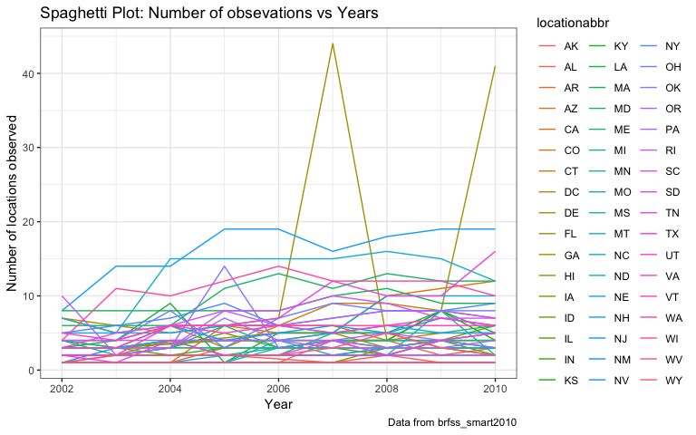
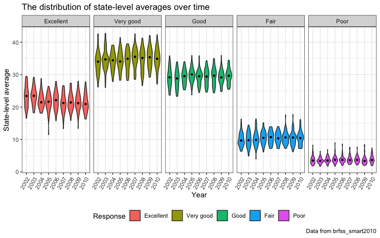

p8105\_hw3\_jl5297
================
Jun Lu
10/11/2018

Overview
--------

This my third homework for Data Science, including my solutions to Problems 1, 2 and 3. And I was praciticing data visualization through this homework.

Problem 1
---------

### 1. Load the data

``` r
data("brfss_smart2010")
```

### 2. Clean data

-   format the data to use appropriate variable names
-   focus on the “Overall Health” topic
-   include only responses from “Excellent” to “Poor”
-   organize responses as a factor taking levels from “Excellent” to “Poor"

``` r
brfss_tidy = 
    brfss_smart2010 %>% 
    janitor::clean_names() %>% 
    filter(topic == "Overall Health") %>%
    filter(response %in% c("Excellent", "Very good","Good", "Fair", "Poor")) %>%
    mutate(response = factor(response, levels = c("Excellent", "Very good", "Good", "Fair", "Poor")))
```

### 3. Solutions to questions

#### a. In 2002, which states were observed at 7 locations?

``` r
state_7loca_2002 = 
    brfss_tidy %>% 
    filter(year == "2002") %>% 
    group_by(locationabbr) %>%
    summarize(location_number = n_distinct(locationdesc)) %>% 
    filter(location_number == 7) %>% 
    print()
## # A tibble: 3 x 2
##   locationabbr location_number
##   <chr>                  <int>
## 1 CT                         7
## 2 FL                         7
## 3 NC                         7
```

Connecticut, Florida and North Carolina were observed at 7 locations.

#### b. Make a “spaghetti plot” that shows the number of observations in each state from 2002 to 2010.

-   group brfss\_tidy by locationabb and year
-   summarize the observations number and make a “spaghetti plot”

``` r
brfss_tidy %>% 
    group_by(locationabbr, year) %>% 
    summarize(obervation_number = n()) %>% 
    ggplot(aes(x = year, y = obervation_number, color = locationabbr)) +
    geom_line() +
    labs(
        title = "Spaghetti Plot: Number of obsevations vs Years",
        y = "Number of obsevations",
        x = "Year",
        caption = "Data from brfss_smart2010" 
        ) +
    theme(legend.position = "right")
```



Generally, the number of observations in each state is different over years. Notably, the number of observation of FL has a big change from 2006 to 2010. Especially in 2007 and 2010, FL has over 200 obersvations. Some states only have a few observations and don't change over years(like WI and WV).

#### c. Make a table showing, for the years 2002, 2006, and 2010, the mean and standard deviation of the proportion of “Excellent” responses across locations in NY State.

-   group brfss\_tidy by locationabb and year
-   filter and summarize the mean and standard deviation

``` r
# use brfss_group to filter and summarize the mean and standard deviation
brfss_tidy %>% 
    group_by(locationabbr, year) %>% 
    filter(year %in% c("2002", "2006", "2010"), locationabbr == "NY", 
           response == "Excellent") %>% 
    summarize(mean = mean(data_value), std = sd(data_value)) %>% 
    knitr::kable(digits = 2)
```

| locationabbr |  year|   mean|   std|
|:-------------|-----:|------:|-----:|
| NY           |  2002|  24.04|  4.49|
| NY           |  2006|  22.53|  4.00|
| NY           |  2010|  22.70|  3.57|

For the years 2002, 2006 and 2010, the mean and standard deviation of the proportion of “Excellent” responses across locations in NY decrease over years.

#### d.Make a five-panel plot that shows, for each response category separately, the distribution of these state-level averages over time.

-   compute the average proportion in each response category
-   make a five-panel plot

``` r
brfss_average =
    brfss_tidy %>% 
    group_by(locationabbr, year, response) %>% 
    summarize(average_prop = mean(data_value, na.rm = T))
head(brfss_average)
## # A tibble: 6 x 4
## # Groups:   locationabbr, year [2]
##   locationabbr  year response  average_prop
##   <chr>        <int> <fct>            <dbl>
## 1 AK            2002 Excellent         27.9
## 2 AK            2002 Very good         33.7
## 3 AK            2002 Good              23.8
## 4 AK            2002 Fair               8.6
## 5 AK            2002 Poor               5.9
## 6 AK            2003 Excellent         24.8

brfss_average %>% 
    ggplot(aes(x = factor(year), y = average_prop)) +
    geom_violin(aes(fill = factor(year))) +
    facet_grid(.~response) +
    stat_summary(fun.y = median, geom = "point", size = 2) +
    labs(
        title = "The distribution of state-level averages over time",
        y = "State-level average",
        x = "Year",
        caption = "Data from brfss_smart2010" 
        ) +
    scale_fill_discrete(name = "Year") +
    theme(axis.text.x = element_text(angle = 60, hjust = 1))
```



-   The disrtibutions of these state-level average in each reponse have a big difference. In most states, "Very good" response tends to have the highest average proportion and "Poor" response tends to have the lowest average proportion among those reponses over time.
-   The distribution of these state-level averages in one response of different years don't have a big difference.
