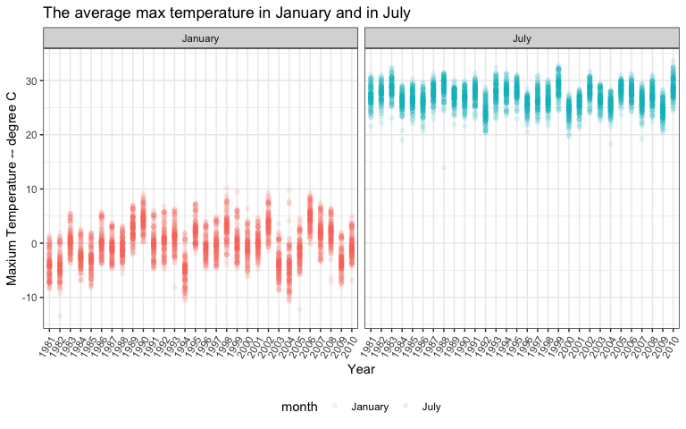
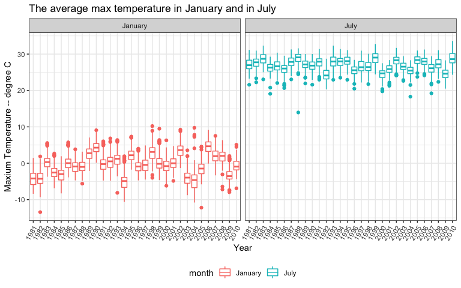
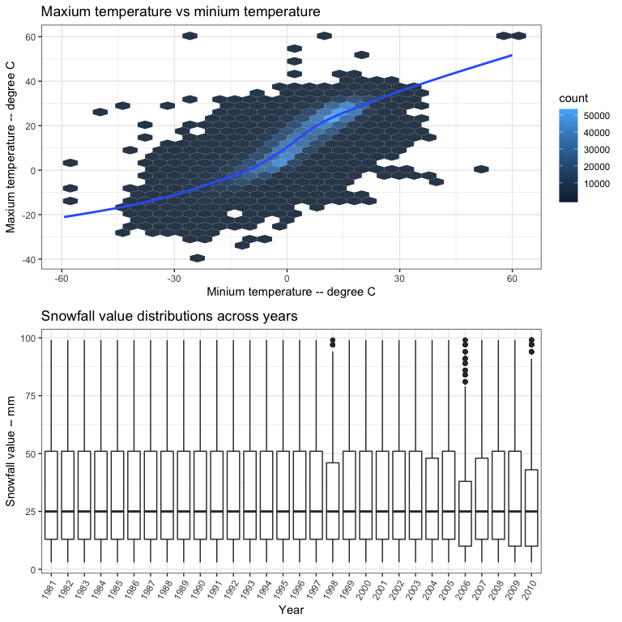

p8105\_hw3\_jl5297
================
Jun Lu
10/11/2018

Overview
--------

This my third homework for Data Science, including my solutions to Problems 1, 2 and 3. And I was praciticing data visualization through this homework.

Problem 1
---------

### 1. Load the data

``` r
data("brfss_smart2010")
```

### 2. Clean data

-   format the data to use appropriate variable names
-   focus on the “Overall Health” topic
-   include only responses from “Excellent” to “Poor”
-   organize responses as a factor taking levels from “Excellent” to “Poor"

``` r
brfss_tidy = 
    brfss_smart2010 %>% 
    janitor::clean_names() %>% 
    filter(topic == "Overall Health") %>%
    filter(response %in% c("Excellent", "Very good","Good", "Fair", "Poor")) %>%
    mutate(response = factor(response, levels = c("Excellent", "Very good", "Good", "Fair", "Poor")))
```

### 3. Solutions to questions

#### a. In 2002, which states were observed at 7 locations?

``` r
state_7loca_2002 = 
    brfss_tidy %>% 
    filter(year == "2002") %>% 
    group_by(locationabbr) %>%
    summarize(location_number = n_distinct(locationdesc)) %>% 
    filter(location_number == 7) %>% 
    print()
```

    ## # A tibble: 3 x 2
    ##   locationabbr location_number
    ##   <chr>                  <int>
    ## 1 CT                         7
    ## 2 FL                         7
    ## 3 NC                         7

Connecticut, Florida and North Carolina were observed at 7 locations.

#### b. Make a “spaghetti plot” that shows the number of locations in each state from 2002 to 2010.

-   group brfss\_tidy by locationabb and year
-   summarize the locations number and make a “spaghetti plot”

``` r
brfss_tidy %>%
    group_by(locationabbr, year) %>% 
    summarize(location_number = n_distinct(locationdesc)) %>% 
    ggplot(aes(x = year, y = location_number, color = locationabbr)) +
    geom_line() +
    labs(
        title = "Spaghetti Plot: Number of obsevations vs Years",
        y = "Number of locations observed",
        x = "Year",
        caption = "Data from brfss_smart2010" 
        ) +
    theme(legend.position = "right")
```


-   We can see the tendency of numbers of location observed in each state from this spaghetti plot.
-   Numbers of locations observed in some states in different years are different.
-   Notably, the number of locations observed of FL has a big change from 2006 to 2010. Especially in 2007 and 2010, FL has over 40 locations observed.
-   Some states only have a few locations observed over years (like WI and WV).

#### c. Make a table showing, for the years 2002, 2006, and 2010, the mean and standard deviation of the proportion of “Excellent” responses across locations in NY State.

-   group brfss\_tidy by locationabb and year
-   filter and summarize the mean and standard deviation

``` r
# use brfss_group to filter and summarize the mean and standard deviation
brfss_tidy %>% 
    group_by(locationabbr, year) %>% 
    filter(year %in% c("2002", "2006", "2010"), locationabbr == "NY", 
           response == "Excellent") %>% 
    summarize(mean = mean(data_value), std = sd(data_value)) %>% 
    knitr::kable(digits = 2)
```

| locationabbr |  year|   mean|   std|
|:-------------|-----:|------:|-----:|
| NY           |  2002|  24.04|  4.49|
| NY           |  2006|  22.53|  4.00|
| NY           |  2010|  22.70|  3.57|

-   2002 has the largest mean of the proportion of “Excellent” responses. 2006 has the smallest mean of the proportion of “Excellent” responses.
-   For the years 2002, 2006 and 2010, the standard deviation of the proportion of “Excellent” responses across locations in NY decrease over years.

#### d. Make a five-panel plot that shows, for each response category separately, the distribution of these state-level averages over time.

-   compute the average proportion in each response category
-   make a five-panel plot

``` r
brfss_average =
    brfss_tidy %>% 
    group_by(locationabbr, year, response) %>% 
    summarize(average_prop = mean(data_value, na.rm = T))
head(brfss_average)
```

    ## # A tibble: 6 x 4
    ## # Groups:   locationabbr, year [2]
    ##   locationabbr  year response  average_prop
    ##   <chr>        <int> <fct>            <dbl>
    ## 1 AK            2002 Excellent         27.9
    ## 2 AK            2002 Very good         33.7
    ## 3 AK            2002 Good              23.8
    ## 4 AK            2002 Fair               8.6
    ## 5 AK            2002 Poor               5.9
    ## 6 AK            2003 Excellent         24.8

``` r
brfss_average %>% 
    ggplot(aes(x = factor(year), y = average_prop)) +
    geom_violin(aes(fill = response)) +
    facet_grid(.~response) +
    stat_summary(fun.y = median, geom = "point", size = 1) +
    labs(
        title = "The distribution of state-level averages over time",
        y = "State-level average",
        x = "Year",
        caption = "Data from brfss_smart2010" 
        ) +
    scale_fill_discrete(name = "Response") +
    theme(axis.text.x = element_text(angle = 60, hjust = 1))
```


-   From this five-panel plot, we can know distributions of these state-level averages of each response.
-   The disrtibutions of these state-level average in each reponse have a big difference. In most states, "Very good" response tends to have the highest average proportion and "Poor" response tends to have the lowest average proportion among those reponses over time.
-   The distributions of these state-level averages in one response of different years don't have a big difference.

Problem 2
---------

### 1. Load the data

``` r
data(instacart)
```

### 2. Do some exploration

-   Take a look at the first 6 rows
-   Take a look at each variable name
-   Get the dimension
-   Take a look at each variable in detail

``` r
head(instacart)
```

    ## # A tibble: 6 x 15
    ##   order_id product_id add_to_cart_order reordered user_id eval_set
    ##      <int>      <int>             <int>     <int>   <int> <chr>   
    ## 1        1      49302                 1         1  112108 train   
    ## 2        1      11109                 2         1  112108 train   
    ## 3        1      10246                 3         0  112108 train   
    ## 4        1      49683                 4         0  112108 train   
    ## 5        1      43633                 5         1  112108 train   
    ## 6        1      13176                 6         0  112108 train   
    ## # ... with 9 more variables: order_number <int>, order_dow <int>,
    ## #   order_hour_of_day <int>, days_since_prior_order <int>,
    ## #   product_name <chr>, aisle_id <int>, department_id <int>, aisle <chr>,
    ## #   department <chr>

``` r
names(instacart)
```

    ##  [1] "order_id"               "product_id"            
    ##  [3] "add_to_cart_order"      "reordered"             
    ##  [5] "user_id"                "eval_set"              
    ##  [7] "order_number"           "order_dow"             
    ##  [9] "order_hour_of_day"      "days_since_prior_order"
    ## [11] "product_name"           "aisle_id"              
    ## [13] "department_id"          "aisle"                 
    ## [15] "department"

``` r
dim(instacart)
```

    ## [1] 1384617      15

``` r
skimr::skim(instacart)
```

    ## Skim summary statistics
    ##  n obs: 1384617 
    ##  n variables: 15 
    ## 
    ## ── Variable type:character ────────────────────────────────────────────────────────────────────────────────────────────
    ##      variable missing complete       n min max empty n_unique
    ##         aisle       0  1384617 1384617   3  29     0      134
    ##    department       0  1384617 1384617   4  15     0       21
    ##      eval_set       0  1384617 1384617   5   5     0        1
    ##  product_name       0  1384617 1384617   3 159     0    39123
    ## 
    ## ── Variable type:integer ──────────────────────────────────────────────────────────────────────────────────────────────
    ##                variable missing complete       n       mean        sd p0
    ##       add_to_cart_order       0  1384617 1384617       8.76      7.42  1
    ##                aisle_id       0  1384617 1384617      71.3      38.1   1
    ##  days_since_prior_order       0  1384617 1384617      17.07     10.43  0
    ##           department_id       0  1384617 1384617       9.84      6.29  1
    ##               order_dow       0  1384617 1384617       2.7       2.17  0
    ##       order_hour_of_day       0  1384617 1384617      13.58      4.24  0
    ##                order_id       0  1384617 1384617 1706297.62 989732.65  1
    ##            order_number       0  1384617 1384617      17.09     16.61  4
    ##              product_id       0  1384617 1384617   25556.24  14121.27  1
    ##               reordered       0  1384617 1384617       0.6       0.49  0
    ##                 user_id       0  1384617 1384617   1e+05     59487.15  1
    ##     p25     p50     p75    p100     hist
    ##       3       7      12      80 ▇▃▁▁▁▁▁▁
    ##      31      83     107     134 ▃▇▃▃▇▅▅▆
    ##       7      15      30      30 ▂▅▃▃▁▂▁▇
    ##       4       8      16      21 ▃▇▂▁▂▆▁▃
    ##       1       3       5       6 ▇▅▃▃▁▃▅▅
    ##      10      14      17      23 ▁▁▃▇▇▇▅▂
    ##  843370 1701880 2568023 3421070 ▇▇▇▇▇▇▇▇
    ##       6      11      21     100 ▇▂▁▁▁▁▁▁
    ##   13380   25298   37940   49688 ▆▆▇▇▇▆▇▇
    ##       0       1       1       1 ▆▁▁▁▁▁▁▇
    ##   51732   1e+05  154959  206209 ▇▇▇▇▇▇▇▇

``` r
str(instacart)
```

    ## Classes 'tbl_df', 'tbl' and 'data.frame':    1384617 obs. of  15 variables:
    ##  $ order_id              : int  1 1 1 1 1 1 1 1 36 36 ...
    ##  $ product_id            : int  49302 11109 10246 49683 43633 13176 47209 22035 39612 19660 ...
    ##  $ add_to_cart_order     : int  1 2 3 4 5 6 7 8 1 2 ...
    ##  $ reordered             : int  1 1 0 0 1 0 0 1 0 1 ...
    ##  $ user_id               : int  112108 112108 112108 112108 112108 112108 112108 112108 79431 79431 ...
    ##  $ eval_set              : chr  "train" "train" "train" "train" ...
    ##  $ order_number          : int  4 4 4 4 4 4 4 4 23 23 ...
    ##  $ order_dow             : int  4 4 4 4 4 4 4 4 6 6 ...
    ##  $ order_hour_of_day     : int  10 10 10 10 10 10 10 10 18 18 ...
    ##  $ days_since_prior_order: int  9 9 9 9 9 9 9 9 30 30 ...
    ##  $ product_name          : chr  "Bulgarian Yogurt" "Organic 4% Milk Fat Whole Milk Cottage Cheese" "Organic Celery Hearts" "Cucumber Kirby" ...
    ##  $ aisle_id              : int  120 108 83 83 95 24 24 21 2 115 ...
    ##  $ department_id         : int  16 16 4 4 15 4 4 16 16 7 ...
    ##  $ aisle                 : chr  "yogurt" "other creams cheeses" "fresh vegetables" "fresh vegetables" ...
    ##  $ department            : chr  "dairy eggs" "dairy eggs" "produce" "produce" ...
    ##  - attr(*, "spec")=List of 2
    ##   ..$ cols   :List of 15
    ##   .. ..$ order_id              : list()
    ##   .. .. ..- attr(*, "class")= chr  "collector_integer" "collector"
    ##   .. ..$ product_id            : list()
    ##   .. .. ..- attr(*, "class")= chr  "collector_integer" "collector"
    ##   .. ..$ add_to_cart_order     : list()
    ##   .. .. ..- attr(*, "class")= chr  "collector_integer" "collector"
    ##   .. ..$ reordered             : list()
    ##   .. .. ..- attr(*, "class")= chr  "collector_integer" "collector"
    ##   .. ..$ user_id               : list()
    ##   .. .. ..- attr(*, "class")= chr  "collector_integer" "collector"
    ##   .. ..$ eval_set              : list()
    ##   .. .. ..- attr(*, "class")= chr  "collector_character" "collector"
    ##   .. ..$ order_number          : list()
    ##   .. .. ..- attr(*, "class")= chr  "collector_integer" "collector"
    ##   .. ..$ order_dow             : list()
    ##   .. .. ..- attr(*, "class")= chr  "collector_integer" "collector"
    ##   .. ..$ order_hour_of_day     : list()
    ##   .. .. ..- attr(*, "class")= chr  "collector_integer" "collector"
    ##   .. ..$ days_since_prior_order: list()
    ##   .. .. ..- attr(*, "class")= chr  "collector_integer" "collector"
    ##   .. ..$ product_name          : list()
    ##   .. .. ..- attr(*, "class")= chr  "collector_character" "collector"
    ##   .. ..$ aisle_id              : list()
    ##   .. .. ..- attr(*, "class")= chr  "collector_integer" "collector"
    ##   .. ..$ department_id         : list()
    ##   .. .. ..- attr(*, "class")= chr  "collector_integer" "collector"
    ##   .. ..$ aisle                 : list()
    ##   .. .. ..- attr(*, "class")= chr  "collector_character" "collector"
    ##   .. ..$ department            : list()
    ##   .. .. ..- attr(*, "class")= chr  "collector_character" "collector"
    ##   ..$ default: list()
    ##   .. ..- attr(*, "class")= chr  "collector_guess" "collector"
    ##   ..- attr(*, "class")= chr "col_spec"

#### Summarize

The "instacart" dataset contains 1384617 observations and 15 variables, where each observation(row) in the dataset is a product from an order. There is a single order per user in this dataset. And there is no missing value in each variable. There are 4 character variables(aisle, department, eval\_set and product\_name), 11 integer variables(other varibales). Product\_name, aisle, department, order\_hour\_of\_day, order\_dow, reordered and add\_to\_cart\_order are key variables.

-   `order_id`: order identifier
-   `product_id`: product identifier
-   `add_to_cart_order`: order in which each product was added to cart
-   `reordered`: 1 if this prodcut has been ordered by this user in the past, 0 otherwise
-   `user_id`: customer identifier
-   `eval_set`: which evaluation set this order belongs in (Note that the data for use in this class is exclusively from the “train” eval\_set)
-   `order_number`: the order sequence number for this user (1=first, n=nth)
-   `order_dow`: the day of the week on which the order was placed
-   `order_hour_of_day`: the hour of the day on which the order was placed
-   `days_since_prior_order`: days since the last order, capped at 30, NA if order\_number=1
-   `product_name`: name of the product
-   `aisle_id`: aisle identifier
-   `department_id`: department identifier
-   `aisle`: the name of the aisle
-   `department`: the name of the department

For example, from the dataset we can know that the Instacart user who has user id 112108 bought a Bulgarian Yogurt in first order from dairy eggs department at 10 o' clock and this order is in yogurt aisle，and he reordered it.

### 3. Solutions to questions

#### a. How many aisles are there, and which aisles are the most items ordered from?

-   count the number of aisles
-   count number of each aisle

``` r
# count the number of aisles 
instacart %>% distinct(aisle) %>% nrow()
```

    ## [1] 134

``` r
# find which aisles are the most items ordered from
aisles_items = instacart %>% count(aisle) %>% arrange(desc(n))
aisles_items
```

    ## # A tibble: 134 x 2
    ##    aisle                              n
    ##    <chr>                          <int>
    ##  1 fresh vegetables              150609
    ##  2 fresh fruits                  150473
    ##  3 packaged vegetables fruits     78493
    ##  4 yogurt                         55240
    ##  5 packaged cheese                41699
    ##  6 water seltzer sparkling water  36617
    ##  7 milk                           32644
    ##  8 chips pretzels                 31269
    ##  9 soy lactosefree                26240
    ## 10 bread                          23635
    ## # ... with 124 more rows

There are 134 aisles and fresh vegetables aisle is the most items ordered from. People tend to order fresh vegetables on Instacart.

#### b. Make a plot that shows the number of items ordered in each aisle.

-   Order aisle in number of items
-   flip coordinate system to make it easy to read

``` r
aisles_items  %>% 
    mutate(aisle = forcats::fct_reorder(aisle, n, .desc = F)) %>% 
    ggplot(aes(x = aisle, y = n)) +
    geom_bar(stat = "identity") +
    labs(
        title = "The number of items ordered in each aisle",
        y = "The number of items ordered", 
        x = "Aisle"
    ) +
    coord_flip() 
```


Numbers of items ordered in fresh vegetables and fresh fruit are extremely larger than any other aisles. Aisles of daily food tend to have large number of items ordered.

#### c. Make a table showing the most popular item aisles “baking ingredients”, “dog food care”, and “packaged vegetables fruits”

-   filter, group by aisle and summarize to get mode in each aisle

``` r
getmode <- function(v) {
   uniqv <- unique(v)
   uniqv[which.max(tabulate(match(v, uniqv)))]
}

instacart %>% 
    filter(aisle %in% c("baking ingredients", "dog food care", "packaged vegetables fruits")) %>% 
    group_by(aisle) %>% 
    summarize(popular_item = getmode(product_name)) %>% 
    knitr::kable()
```

| aisle                      | popular\_item                                 |
|:---------------------------|:----------------------------------------------|
| baking ingredients         | Light Brown Sugar                             |
| dog food care              | Snack Sticks Chicken & Rice Recipe Dog Treats |
| packaged vegetables fruits | Organic Baby Spinach                          |

-   "Light Brown Sugar" is the most popular item in "baking ingredients" aisle.
-   "Snack Sticks Chicken & Rice Recipe Dog Treats" is the most popular item in "dog food care" aisle.
-   "Organic Baby Spinach" is the most popular item in "packaged vegetables fruits" aisle.

#### d. Make a table showing the mean hour of the day at which Pink Lady Apples and Coffee Ice Cream are ordered on each day of the week

-   use instacart dataset to filter, group by product\_name, summarize to get the mean of order\_hour\_of\_day, and spread to make it readable
-   assume 0 to 6 equal to Sunday to Saturday

``` r
weekdays = c("Sun", "Mon", "Tues", "Wed", "Thurs", "Fri", "Sat")
weekdays = factor(weekdays, levels = c("Sun", "Mon", "Tues", "Wed", "Thurs", "Fri", "Sat"))
instacart %>% 
    filter(product_name %in% c("Pink Lady Apples", "Coffee Ice Cream")) %>% 
    group_by(product_name, order_dow) %>% 
    summarize(mean_hour = mean(order_hour_of_day)) %>%
    mutate(order_dow = weekdays[as.integer(order_dow) + 1]) %>% 
    spread(key = order_dow, value = mean_hour) %>% 
    knitr::kable(digits = 2)
```

| product\_name    |    Sun|    Mon|   Tues|    Wed|  Thurs|    Fri|    Sat|
|:-----------------|------:|------:|------:|------:|------:|------:|------:|
| Coffee Ice Cream |  13.77|  14.32|  15.38|  15.32|  15.22|  12.26|  13.83|
| Pink Lady Apples |  13.44|  11.36|  11.70|  14.25|  11.55|  12.78|  11.94|

-   Instacart users tend to order Coffee Ice Cream at afternoon or noon. And on the middle of the week people tend to order Coffee Ice Cream at a relatively late time of the day.
-   Instacart users tend to order Pink Lady Apples around noon, but on Wednesday people tend to order Pink Lady Apples at a relatively late time around 2 o'clock.

Problem 3
---------

### 1. Load the data

``` r
data("ny_noaa")
```

### 2. Do some exploration

-   Take a look at the first 6 rows
-   Take a look at each variable name
-   Get the dimension
-   Take a look at each variable in detail
-   Look at the missing value

``` r
# Take a look at the first 6 rows
head(ny_noaa)
```

    ## # A tibble: 6 x 7
    ##   id          date        prcp  snow  snwd tmax  tmin 
    ##   <chr>       <date>     <int> <int> <int> <chr> <chr>
    ## 1 US1NYAB0001 2007-11-01    NA    NA    NA <NA>  <NA> 
    ## 2 US1NYAB0001 2007-11-02    NA    NA    NA <NA>  <NA> 
    ## 3 US1NYAB0001 2007-11-03    NA    NA    NA <NA>  <NA> 
    ## 4 US1NYAB0001 2007-11-04    NA    NA    NA <NA>  <NA> 
    ## 5 US1NYAB0001 2007-11-05    NA    NA    NA <NA>  <NA> 
    ## 6 US1NYAB0001 2007-11-06    NA    NA    NA <NA>  <NA>

``` r
# Take a look at each variable name
names(ny_noaa)
```

    ## [1] "id"   "date" "prcp" "snow" "snwd" "tmax" "tmin"

``` r
# Get the dimension
dim(ny_noaa)
```

    ## [1] 2595176       7

``` r
# Take a look at each variable in detail
skimr::skim(ny_noaa)
```

    ## Skim summary statistics
    ##  n obs: 2595176 
    ##  n variables: 7 
    ## 
    ## ── Variable type:character ────────────────────────────────────────────────────────────────────────────────────────────
    ##  variable missing complete       n min max empty n_unique
    ##        id       0  2595176 2595176  11  11     0      747
    ##      tmax 1134358  1460818 2595176   1   4     0      532
    ##      tmin 1134420  1460756 2595176   1   4     0      548
    ## 
    ## ── Variable type:Date ─────────────────────────────────────────────────────────────────────────────────────────────────
    ##  variable missing complete       n        min        max     median
    ##      date       0  2595176 2595176 1981-01-01 2010-12-31 1997-01-21
    ##  n_unique
    ##     10957
    ## 
    ## ── Variable type:integer ──────────────────────────────────────────────────────────────────────────────────────────────
    ##  variable missing complete       n  mean     sd  p0 p25 p50 p75  p100
    ##      prcp  145838  2449338 2595176 29.82  78.18   0   0   0  23 22860
    ##      snow  381221  2213955 2595176  4.99  27.22 -13   0   0   0 10160
    ##      snwd  591786  2003390 2595176 37.31 113.54   0   0   0   0  9195
    ##      hist
    ##  ▇▁▁▁▁▁▁▁
    ##  ▇▁▁▁▁▁▁▁
    ##  ▇▁▁▁▁▁▁▁

``` r
str(ny_noaa)
```

    ## Classes 'tbl_df', 'tbl' and 'data.frame':    2595176 obs. of  7 variables:
    ##  $ id  : chr  "US1NYAB0001" "US1NYAB0001" "US1NYAB0001" "US1NYAB0001" ...
    ##  $ date: Date, format: "2007-11-01" "2007-11-02" ...
    ##  $ prcp: int  NA NA NA NA NA NA NA NA NA NA ...
    ##  $ snow: int  NA NA NA NA NA NA NA NA NA NA ...
    ##  $ snwd: int  NA NA NA NA NA NA NA NA NA NA ...
    ##  $ tmax: chr  NA NA NA NA ...
    ##  $ tmin: chr  NA NA NA NA ...
    ##  - attr(*, "spec")=List of 2
    ##   ..$ cols   :List of 7
    ##   .. ..$ id  : list()
    ##   .. .. ..- attr(*, "class")= chr  "collector_character" "collector"
    ##   .. ..$ date:List of 1
    ##   .. .. ..$ format: chr ""
    ##   .. .. ..- attr(*, "class")= chr  "collector_date" "collector"
    ##   .. ..$ prcp: list()
    ##   .. .. ..- attr(*, "class")= chr  "collector_integer" "collector"
    ##   .. ..$ snow: list()
    ##   .. .. ..- attr(*, "class")= chr  "collector_integer" "collector"
    ##   .. ..$ snwd: list()
    ##   .. .. ..- attr(*, "class")= chr  "collector_integer" "collector"
    ##   .. ..$ tmax: list()
    ##   .. .. ..- attr(*, "class")= chr  "collector_character" "collector"
    ##   .. ..$ tmin: list()
    ##   .. .. ..- attr(*, "class")= chr  "collector_character" "collector"
    ##   ..$ default: list()
    ##   .. ..- attr(*, "class")= chr  "collector_guess" "collector"
    ##   ..- attr(*, "class")= chr "col_spec"

``` r
# Number and proportion of observations containing NA
sum(!complete.cases(ny_noaa))
```

    ## [1] 1372743

``` r
sum(!complete.cases(ny_noaa)) / nrow(ny_noaa)
```

    ## [1] 0.5289595

``` r
# NA in each variable
na_num = sapply(ny_noaa, function(x) sum(is.na(x)))
na_prop = sapply(ny_noaa, function(x) sum(is.na(x) / nrow(ny_noaa)))
rbind(na_num, na_prop) %>% knitr::kable(digits = 2)
```

|          |   id|  date|       prcp|       snow|       snwd|        tmax|        tmin|
|----------|----:|-----:|----------:|----------:|----------:|-----------:|-----------:|
| na\_num  |    0|     0|  145838.00|  381221.00|  591786.00|  1134358.00|  1134420.00|
| na\_prop |    0|     0|       0.06|       0.15|       0.23|        0.44|        0.44|

#### Summarize

The "ny\_noaa" dataset contains 2595176 observations and 7 variables, where each row in the dataset is observation data in one day of one weather station in New York state. There are 1 Date variable(date), 3 character variables(id, tmax and tmin) and 3 integer variables(prcp, snow, snwd). And prcp, snow, snwd, tmax, and tmin are key variables. There are a number of NA in this dataset where more than a half rows contains NA. Notably, 44 percent of temperature records(tmin and tmax) are NAs which can be a big issue in analysis. (Other NAs proportions: prcp(0.06), snow(0.15) and snwd(0.23))

-   `id`: Weather station ID
-   `date`: Date of observation
-   `prcp`: Precipitation (tenths of mm)
-   `snow`: Snowfall (mm)
-   `snwd`: Snow depth (mm)
-   `tmax`: Maximum temperature (tenths of degrees C)
-   `tmin`: Minimum temperature (tenths of degrees C)

### 3. Solutions to questions

#### a. Do some data cleaning.

-   create separate variables for year, month, and day.
-   change tmax and tmin to numeric and divide them by 10 using dergree C unit
-   divide prcp by 10 using mm unit

``` r
ny_noaa_tidy =
    ny_noaa %>% 
    mutate(date = as.character(date)) %>% 
    separate(date, c("year", "month", "day"), sep = "-") %>% 
    mutate(month = month.name[as.integer(month)]) %>% 
    mutate(tmax = as.numeric(tmax) / 10, 
           tmin = as.numeric(tmin) / 10,
           prcp = prcp / 10) 
```

#### b. Find the most common value for snowfall

``` r
ny_noaa_tidy %>% 
    filter(!is.na(snow)) %>% 
    count(snow) %>%  
    top_n(1)
```

    ## Selecting by n

    ## # A tibble: 1 x 2
    ##    snow       n
    ##   <int>   <int>
    ## 1     0 2008508

For snowfall, the most common value is 0 because most of time there is no snow in NY.

#### c. Make a two-panel plot showing the average maxium temperature in January and in July in each station across years.

``` r
ny_noaa_tidy %>% 
    filter(month %in% c("January", "July")) %>%
    group_by(id, year, month) %>% 
    summarize(average_tempmax = mean(tmax, na.rm = T)) %>% 
    ggplot(aes(x = year, y = average_tempmax, color = month)) +
    geom_point(alpha = 0.1) +
    facet_grid(.~month) +
    labs(
        title = "The average max temperature in January and in July",
        x = "Year",
        y = "Maxium Temperature -- degree C"
    ) +
    theme(axis.text.x = element_text(angle = 60, hjust = 1)) 
```

    ## Warning: Removed 5970 rows containing missing values (geom_point).



``` r
ny_noaa_tidy %>% 
    filter(month %in% c("January", "July")) %>%
    group_by(id, year, month) %>% 
    summarize(average_tempmax = mean(tmax, na.rm = T)) %>% 
    ggplot(aes(x = year, y = average_tempmax, color = month)) +
    geom_boxplot() +
    facet_grid(.~month) +
    labs(
        title = "The average max temperature in January and in July",
        x = "Year",
        y = "Maxium Temperature -- degree C"
    ) +
    theme(axis.text.x = element_text(angle = 60, hjust = 1)) 
```

    ## Warning: Removed 5970 rows containing non-finite values (stat_boxplot).



From the plot we can know that:

-   The maxium temperature of July tends to be at least 10 degrees higher than that of January over years in NY.
-   The maxium temparture of January vary greatly over years comparing to July.
-   There are outliers in both January and July. Outliers of July tend to be lower cases.

#### d. Make a two-panel plot showing (i) tmax vs tmin for the full dataset and (ii) make a plot showing the distribution of snowfall values greater than 0 and less than 100 separately by year.

``` r
temp_plot =
    ny_noaa_tidy %>% 
    ggplot(aes(x = tmin, y = tmax)) +
    geom_hex(alpha = 0.9) +
    geom_smooth(se = FALSE) +
    labs(
        title = "Maxium temperature vs minium temperature",
        y = "Maxium temperature -- degree C",
        x = "Minium temperature -- degree C"
    ) +
    theme(legend.position = "right")

library(ggridges)
```

    ## 
    ## Attaching package: 'ggridges'

    ## The following object is masked from 'package:ggplot2':
    ## 
    ##     scale_discrete_manual

``` r
snowfall_dist = 
    ny_noaa_tidy %>% 
    filter(snow > 0 & snow < 100) %>%
    ggplot(aes(x = year, y = snow)) +
    geom_boxplot() +
    labs( 
        title = "Snowfall value distributions across years",
        y = "Snowfall value -- mm",
        x = "Year"
    ) +
    theme(axis.text.x = element_text(angle = 60, hjust = 1))

temp_plot + snowfall_dist + plot_layout(ncol = 1) 
```

    ## Warning: Removed 1136276 rows containing non-finite values (stat_binhex).

    ## `geom_smooth()` using method = 'gam' and formula 'y ~ s(x, bs = "cs")'

    ## Warning: Removed 1136276 rows containing non-finite values (stat_smooth).



From the plot we can know that:

-   There is a positive correlation between the maxium temparure and the minium temperature.
-   The distributions of snowfall in each year are smiliar, except 1998, 2004, 2006, 2007 and 2010. Notably, there are a number of outliers(extreme large) in 2006.
