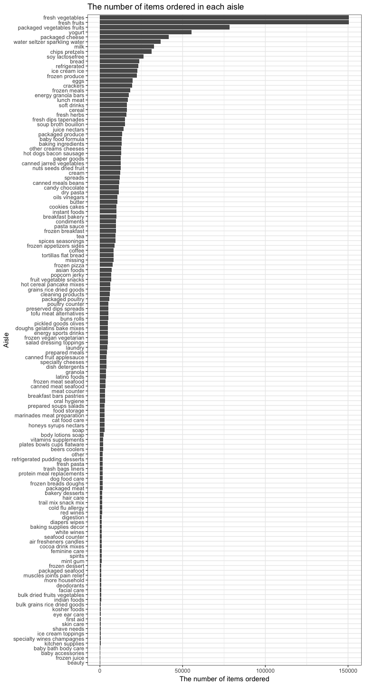

p8105\_hw3\_jl5297
================
Jun Lu
10/11/2018

Overview
--------

This my third homework for Data Science, including my solutions to Problems 1, 2 and 3. And I was praciticing data visualization through this homework.

Problem 1
---------

### 1. Load the data

``` r
data("brfss_smart2010")
```

### 2. Clean data

-   format the data to use appropriate variable names
-   focus on the “Overall Health” topic
-   include only responses from “Excellent” to “Poor”
-   organize responses as a factor taking levels from “Excellent” to “Poor"

``` r
brfss_tidy = 
    brfss_smart2010 %>% 
    janitor::clean_names() %>% 
    filter(topic == "Overall Health") %>%
    filter(response %in% c("Excellent", "Very good","Good", "Fair", "Poor")) %>%
    mutate(response = factor(response, levels = c("Excellent", "Very good", "Good", "Fair", "Poor")))
```

### 3. Solutions to questions

#### a. In 2002, which states were observed at 7 locations?

``` r
state_7loca_2002 = 
    brfss_tidy %>% 
    filter(year == "2002") %>% 
    group_by(locationabbr) %>%
    summarize(location_number = n_distinct(locationdesc)) %>% 
    filter(location_number == 7) %>% 
    print()
```

    ## # A tibble: 3 x 2
    ##   locationabbr location_number
    ##   <chr>                  <int>
    ## 1 CT                         7
    ## 2 FL                         7
    ## 3 NC                         7

Connecticut, Florida and North Carolina were observed at 7 locations.

#### b. Make a “spaghetti plot” that shows the number of observations in each state from 2002 to 2010.

-   group brfss\_tidy by locationabb and year
-   summarize the observations number and make a “spaghetti plot”

``` r
brfss_tidy %>% 
    group_by(locationabbr, year) %>% 
    summarize(obervation_number = n()) %>% 
    ggplot(aes(x = year, y = obervation_number, color = locationabbr)) +
    geom_line() +
    labs(
        title = "Spaghetti Plot: Number of obsevations vs Years",
        y = "Number of obsevations",
        x = "Year",
        caption = "Data from brfss_smart2010" 
        ) +
    theme(legend.position = "right")
```


Generally, the number of observations in each state is different over years. Notably, the number of observation of FL has a big change from 2006 to 2010. Especially in 2007 and 2010, FL has over 200 obersvations. Some states only have a few observations and don't change over years(like WI and WV).

#### c. Make a table showing, for the years 2002, 2006, and 2010, the mean and standard deviation of the proportion of “Excellent” responses across locations in NY State.

-   group brfss\_tidy by locationabb and year
-   filter and summarize the mean and standard deviation

``` r
# use brfss_group to filter and summarize the mean and standard deviation
brfss_tidy %>% 
    group_by(locationabbr, year) %>% 
    filter(year %in% c("2002", "2006", "2010"), locationabbr == "NY", 
           response == "Excellent") %>% 
    summarize(mean = mean(data_value), std = sd(data_value)) %>% 
    knitr::kable(digits = 2)
```

| locationabbr |  year|   mean|   std|
|:-------------|-----:|------:|-----:|
| NY           |  2002|  24.04|  4.49|
| NY           |  2006|  22.53|  4.00|
| NY           |  2010|  22.70|  3.57|

For the years 2002, 2006 and 2010, the mean and standard deviation of the proportion of “Excellent” responses across locations in NY decrease over years.

#### d. Make a five-panel plot that shows, for each response category separately, the distribution of these state-level averages over time.

-   compute the average proportion in each response category
-   make a five-panel plot

``` r
brfss_average =
    brfss_tidy %>% 
    group_by(locationabbr, year, response) %>% 
    summarize(average_prop = mean(data_value, na.rm = T))
head(brfss_average)
```

    ## # A tibble: 6 x 4
    ## # Groups:   locationabbr, year [2]
    ##   locationabbr  year response  average_prop
    ##   <chr>        <int> <fct>            <dbl>
    ## 1 AK            2002 Excellent         27.9
    ## 2 AK            2002 Very good         33.7
    ## 3 AK            2002 Good              23.8
    ## 4 AK            2002 Fair               8.6
    ## 5 AK            2002 Poor               5.9
    ## 6 AK            2003 Excellent         24.8

``` r
brfss_average %>% 
    ggplot(aes(x = factor(year), y = average_prop)) +
    geom_violin(aes(fill = factor(year))) +
    facet_grid(.~response) +
    stat_summary(fun.y = median, geom = "point", size = 2) +
    labs(
        title = "The distribution of state-level averages over time",
        y = "State-level average",
        x = "Year",
        caption = "Data from brfss_smart2010" 
        ) +
    scale_fill_discrete(name = "Year") +
    theme(axis.text.x = element_text(angle = 60, hjust = 1))
```


-   The disrtibutions of these state-level average in each reponse have a big difference. In most states, "Very good" response tends to have the highest average proportion and "Poor" response tends to have the lowest average proportion among those reponses over time.
-   The distribution of these state-level averages in one response of different years don't have a big difference.

Problem 2
---------

### 1. Load the data

``` r
data(instacart)
```

### 2. Do some exploration

-   Take a look at the first 6 rows
-   Take a look at each variable name
-   Get the dimension
-   Take a look at each variable in detail

``` r
head(instacart)
```

    ## # A tibble: 6 x 15
    ##   order_id product_id add_to_cart_order reordered user_id eval_set
    ##      <int>      <int>             <int>     <int>   <int> <chr>   
    ## 1        1      49302                 1         1  112108 train   
    ## 2        1      11109                 2         1  112108 train   
    ## 3        1      10246                 3         0  112108 train   
    ## 4        1      49683                 4         0  112108 train   
    ## 5        1      43633                 5         1  112108 train   
    ## 6        1      13176                 6         0  112108 train   
    ## # ... with 9 more variables: order_number <int>, order_dow <int>,
    ## #   order_hour_of_day <int>, days_since_prior_order <int>,
    ## #   product_name <chr>, aisle_id <int>, department_id <int>, aisle <chr>,
    ## #   department <chr>

``` r
names(instacart)
```

    ##  [1] "order_id"               "product_id"            
    ##  [3] "add_to_cart_order"      "reordered"             
    ##  [5] "user_id"                "eval_set"              
    ##  [7] "order_number"           "order_dow"             
    ##  [9] "order_hour_of_day"      "days_since_prior_order"
    ## [11] "product_name"           "aisle_id"              
    ## [13] "department_id"          "aisle"                 
    ## [15] "department"

``` r
dim(instacart)
```

    ## [1] 1384617      15

``` r
skimr::skim(instacart)
```

    ## Skim summary statistics
    ##  n obs: 1384617 
    ##  n variables: 15 
    ## 
    ## ── Variable type:character ────────────────────────────────────────────────────────────────
    ##      variable missing complete       n min max empty n_unique
    ##         aisle       0  1384617 1384617   3  29     0      134
    ##    department       0  1384617 1384617   4  15     0       21
    ##      eval_set       0  1384617 1384617   5   5     0        1
    ##  product_name       0  1384617 1384617   3 159     0    39123
    ## 
    ## ── Variable type:integer ──────────────────────────────────────────────────────────────────
    ##                variable missing complete       n       mean        sd p0
    ##       add_to_cart_order       0  1384617 1384617       8.76      7.42  1
    ##                aisle_id       0  1384617 1384617      71.3      38.1   1
    ##  days_since_prior_order       0  1384617 1384617      17.07     10.43  0
    ##           department_id       0  1384617 1384617       9.84      6.29  1
    ##               order_dow       0  1384617 1384617       2.7       2.17  0
    ##       order_hour_of_day       0  1384617 1384617      13.58      4.24  0
    ##                order_id       0  1384617 1384617 1706297.62 989732.65  1
    ##            order_number       0  1384617 1384617      17.09     16.61  4
    ##              product_id       0  1384617 1384617   25556.24  14121.27  1
    ##               reordered       0  1384617 1384617       0.6       0.49  0
    ##                 user_id       0  1384617 1384617   1e+05     59487.15  1
    ##     p25     p50     p75    p100     hist
    ##       3       7      12      80 ▇▃▁▁▁▁▁▁
    ##      31      83     107     134 ▃▇▃▃▇▅▅▆
    ##       7      15      30      30 ▂▅▃▃▁▂▁▇
    ##       4       8      16      21 ▃▇▂▁▂▆▁▃
    ##       1       3       5       6 ▇▅▃▃▁▃▅▅
    ##      10      14      17      23 ▁▁▃▇▇▇▅▂
    ##  843370 1701880 2568023 3421070 ▇▇▇▇▇▇▇▇
    ##       6      11      21     100 ▇▂▁▁▁▁▁▁
    ##   13380   25298   37940   49688 ▆▆▇▇▇▆▇▇
    ##       0       1       1       1 ▆▁▁▁▁▁▁▇
    ##   51732   1e+05  154959  206209 ▇▇▇▇▇▇▇▇

#### Summarize

The "instacart" dataset contains 1384617 observations and 15 variables, where each observation(row) in the dataset is a product from an order. There is a single order per user in this dataset. And there is no missing value in each variable. There are 4 character variables(aisle, department, eval\_set and product\_name), 11 integer variables(other varibales). Product\_name, aisle, department, order\_hour\_of\_day, order\_dow, reordered and add\_to\_cart\_order are key variables.

-   `order_id`: order identifier
-   `product_id`: product identifier
-   `add_to_cart_order`: order in which each product was added to cart
-   `reordered`: 1 if this prodcut has been ordered by this user in the past, 0 otherwise
-   `user_id`: customer identifier
-   `eval_set`: which evaluation set this order belongs in (Note that the data for use in this class is exclusively from the “train” eval\_set)
-   `order_number`: the order sequence number for this user (1=first, n=nth)
-   `order_dow`: the day of the week on which the order was placed
-   `order_hour_of_day`: the hour of the day on which the order was placed
-   `days_since_prior_order`: days since the last order, capped at 30, NA if order\_number=1
-   `product_name`: name of the product
-   `aisle_id`: aisle identifier
-   `department_id`: department identifier
-   `aisle`: the name of the aisle
-   `department`: the name of the department

For example, from the dataset we can know that the Instacart user who has user id 112108 bought a Bulgarian Yogurt in first order from dairy eggs department at 10 o' clock and this order is in yogurt aisle，and he reordered it.

### 3. Solutions to questions

#### a. How many aisles are there, and which aisles are the most items ordered from?

-   count the number of aisles
-   count number of each aisle

``` r
# count the number of aisles 
instacart %>% distinct(aisle) %>% nrow()
```

    ## [1] 134

``` r
# find which aisles are the most items ordered from
aisles_items = instacart %>% count(aisle) %>% arrange(desc(n))
aisles_items
```

    ## # A tibble: 134 x 2
    ##    aisle                              n
    ##    <chr>                          <int>
    ##  1 fresh vegetables              150609
    ##  2 fresh fruits                  150473
    ##  3 packaged vegetables fruits     78493
    ##  4 yogurt                         55240
    ##  5 packaged cheese                41699
    ##  6 water seltzer sparkling water  36617
    ##  7 milk                           32644
    ##  8 chips pretzels                 31269
    ##  9 soy lactosefree                26240
    ## 10 bread                          23635
    ## # ... with 124 more rows

There are 134 aisles and fresh vegetables aisle is the most items ordered from. People tend to order fresh vegetables on Instacart.

#### b. Make a plot that shows the number of items ordered in each aisle.

-   Order aisle in number of items
-   flip coordinate system to make it easy to read

``` r
aisles_items  %>% 
    mutate(aisle = forcats::fct_reorder(aisle, n, .desc = F)) %>% 
    ggplot(aes(x = aisle, y = n)) +
    geom_bar(stat = "identity") +
    labs(
        title = "The number of items ordered in each aisle",
        y = "The number of items ordered", 
        x = "Aisle"
    ) +
    coord_flip()
```



The number of items ordered in fresh vegetables and fresh fruit are extremely larger than any other aisles. Aisles of daily food tends to have large number of items ordered.

#### c. Make a table showing the most popular item aisles “baking ingredients”, “dog food care”, and “packaged vegetables fruits”

-   filter, group by aisle and summarize to get mode in each aisle

``` r
getmode <- function(v) {
   uniqv <- unique(v)
   uniqv[which.max(tabulate(match(v, uniqv)))]
}

instacart %>% 
    filter(aisle %in% c("baking ingredients", "dog food care", "packaged vegetables fruits")) %>% 
    group_by(aisle) %>% 
    summarize(popular_item = getmode(product_name)) %>% 
    knitr::kable()
```

| aisle                          | popular\_item                                                           |
|:-------------------------------|:------------------------------------------------------------------------|
| baking ingredients             | Light Brown Sugar                                                       |
| dog food care                  | Snack Sticks Chicken & Rice Recipe Dog Treats                           |
| packaged vegetables fruits     | Organic Baby Spinach                                                    |
| \* "Light Brown Sugar" is the  | most popular item in "baking ingredients" aisle.                        |
| \* "Snack Sticks Chicken & Ric | e Recipe Dog Treats" is the most popular item in "dog food care" aisle. |
| \* "Organic Baby Spinach" is t | he most popular item in "packaged vegetables fruits" aisle.             |

#### d. Make a table showing the mean hour of the day at which Pink Lady Apples and Coffee Ice Cream are ordered on each day of the week

-   use instacart dataset to filter, group by product\_name, summarize to get the mean of order\_hour\_of\_day, and spread to make it readable

``` r
instacart %>% 
    filter(product_name %in% c("Pink Lady Apples", "Coffee Ice Cream")) %>% 
    group_by(product_name, order_dow) %>% 
    summarize(mean_hour = mean(order_hour_of_day)) %>% 
    spread(key = order_dow, value = mean_hour) %>% 
    knitr::kable()
```

| product\_name    |         0|         1|         2|         3|         4|         5|         6|
|:-----------------|---------:|---------:|---------:|---------:|---------:|---------:|---------:|
| Coffee Ice Cream |  13.77419|  14.31579|  15.38095|  15.31818|  15.21739|  12.26316|  13.83333|
| Pink Lady Apples |  13.44118|  11.36000|  11.70213|  14.25000|  11.55172|  12.78431|  11.93750|

-   Instacart users tend to order Coffee Ice Cream at afternoon or noon. And on the middle of the week people tend to order Coffee Ice Cream at a relatively late time of the day.
-   Instacart users tend to order Pink Lady Apples around noon, but on Wednesday people tend to order Pink Lady Apples at a relatively late time around 2 o'clock.
